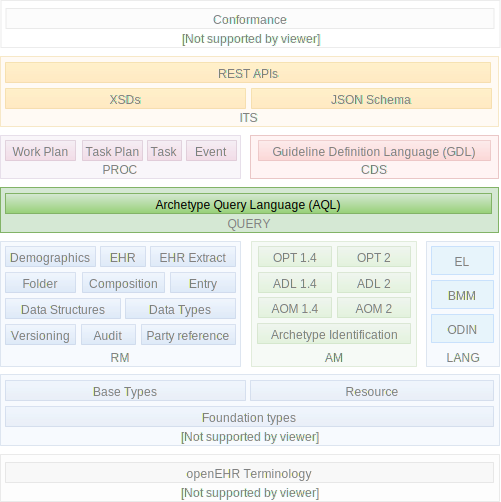

//
// ============================================ Asciidoc HEADER =============================================
//
:doctype: book
:pagenums:
:numbered!:
// git rid of PDF 'Chapter' labs on level 1 headings
:chapter-label:
//
// HTML-only attributes
//
:linkcss:
:keywords: query languages
:description: openEHR Query Component
:sectanchors:

include::{ref_dir}/docs/boilerplate/global_vars.adoc[]

//
// ============================================ Asciidoc PREAMBLE =============================================
//

image::{openehr_logo}["openEHR logo",align="center"]

= Query Languages (QUERY) Component - {query_release}

// Use the following version for 'latest'
ifeval::["{query_release}" == "latest"]
[.title-para]
{component_prs}[Open Issues^] | {component_roadmap}[Roadmap^] | {component_history}[Previous Releases^]
endif::[]

// Use the following version for a named release
ifeval::["{query_release}" != "latest"]
:query_prs_fixed: {component_prs_fixed}{query_release}/issues
:query_crs_done: {component_crs_done}{query_release}/changes
[.title-para]
{query_prs_fixed}[Issues Fixed^] | {query_crs_done}[Changes Implemented^] | {component_roadmap}[Roadmap^] | {component_history}[Change History^]
endif::[]

== Specifications

[cols="2,5", options="header"]
|===
|Specification |Description

|link:/releases/QUERY/{query_release}/AQL.html[Archetype Query Language (AQL)]
|Query language based on archetype paths and pattern matching.

|===

== Computable Expressions

[cols="2,5", options="header"]
|===
|Resource |Description

|link:/releases/QUERY/{query_release}/docs/AQL/Aql.g[Antlr file]
|Antlr 3 Grammar for AQL

|===
